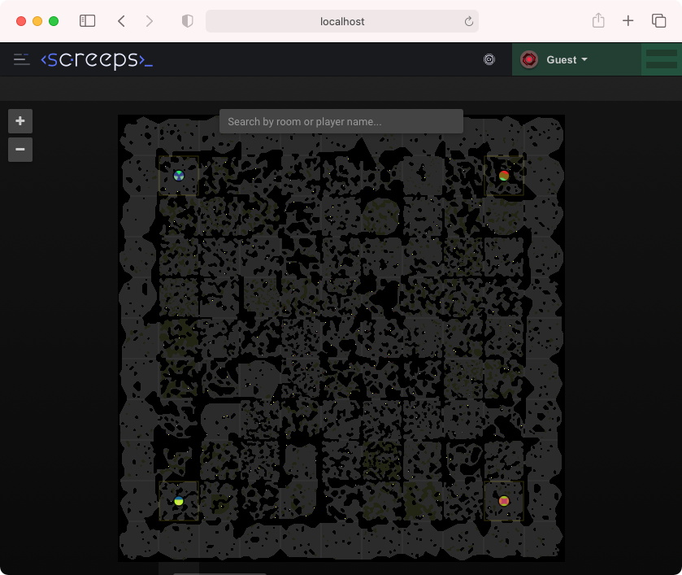

# xxscreeps browser frontend

## About
This package provides local browser access to [xxscreeps](https://github.com/laverdet/xxscreeps)
users who have purchased the [official Screeps
app](https://store.steampowered.com/app/464350/Screeps/) on Steam.

I personally run into a lot of issues with the official client, especially on macOS. The official
client is simply an [NW.js](https://nwjs.io/) wrapper around an [AngularJS](https://angularjs.org/)
app. The version of NW.js included with the client is fairly ancient; at the time of this writing it
was based on Chrome 76 [July 2019] -- a two year old version. I made this package because I was
experiencing frequent crashes in the official client, and I desired a native experience on my Apple
M1-based computer.

This client just serves up the Screeps client files which are already sitting in your Steam folder.
It also adds some basic endpoints for authentication via Steam OpenID. For all intents and purposes
it is the official client but running in the browser of your choice.


## Installation
*Do not* install this mod on a public server or you will be distributing copyrighted content.

To use this package you can run `npm install '@xxscreeps/client'` and add
`'@xxscreeps/client'` to your `mods` configuration in `.screepsrc.yaml`. This module must be
installed as a peer to xxscreeps!

From scratch instructions for installing xxscreeps + this client follows:
```
mkdir xxscreeps
cd xxscreeps
npm init -y
npm install github:laverdet/xxscreeps github:laverdet/xxscreeps-client
npm explore xxscreeps -- npm run build
npm explore @xxscreeps/client -- npm run build    # Ignore these errors :)
# Save .screepsrc.yaml (see below)
npx xxscreeps import
npx xxscreeps start
```

`.screepsrc.yaml` content:
```
backend:
  secret: 'you can make up anything you want'
  steamApiKey: # Get your key from http://steamcommunity.com/dev/apikey
mods:
  - 'xxscreeps/mods/classic'
  - 'xxscreeps/mods/backend/password'
  - 'xxscreeps/mods/backend/steam'
  - '@xxscreeps/client'
```

After that you can now visit: http://localhost:21025/.

## Tips
This client makes use of "guest mode" which is enabled by default in xxscreeps. This will provide
you with a read-only view of the server when you are not signed in. The client will show you as
signed in as user Guest and your icon will belong to the Invader user. To sign in with your Steam
account you need to select "Sign Out" first, which will sign you out of Guest and bring you to the
real login page. Click the Steam icon towards the bottom to sign-in with your Steam account and play
the game as normal. If you want to turn guest access off you can disable it in your
`.screepsrc.yaml` file, and you will be required to login each time.

If you run into problems try running `delete localStorage.auth` in the developer console and
restarting.


